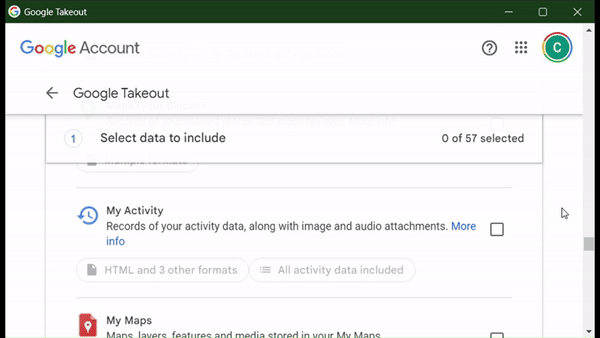
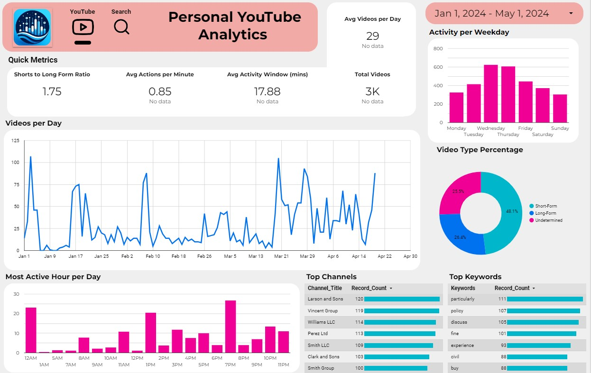

# **Self Stats** - Google Takeout Data Insights Visualizer 📊

Welcome to **Self Stats Google Takeout Data Insights Visualizer**! This Python package revolutionizes how you interact with your personal Google Analytics data extracted via Google Takeout. By offering eye-catching, interactive visualizations, this tool helps you gain deep insights into your digital footprint with Google services. Whether you're a data enthusiast or simply curious about your online habits, this tool provides valuable perspectives into your personal analytics data.

## Features 🌟

- **Automated Data Processing**: Import and analyze your personal Google Analytics data from Google Takeout.
- **Interactive Visualizations**: Engage with your data through beautifully designed graphs and interactive charts.
- **Insight Discovery**: Discover trends, patterns, and more from your personal usage data.
- **User-Friendly Interface**: Easy setup and intuitive controls make your data exploration enjoyable and straightforward.

## Getting Started 🚀

### Prerequisites

To use the Google Takeout Data Insights Visualizer, you will need:

- Python 3.6 or higher
- Pip for Python package management

### Installation

Install this package using pip:

```bash
pip install self_stats
```

You will then need to install a word model from spacy for keyword analysis.

```bash
python3 -m spacy download en_core_web_sm
```

### Data Preparation

#### Downloading Your Data from Google Takeout

- Open your web browser and go to [Google Takeout](https://takeout.google.com/).
- Google Takeout allows you to export data from your Google account products.
- Choose the Google products you want data from. Ensure you have selected **"MyActivity"** and **"YouTube and YouTube Music"**
- Change the file format to **JSON**. The default is HTML and will be incompatible with this pipeline.
- Once your archive is ready, Google will notify you via email.
- Download the archive and extract it.



#### Setting Up the Visualizer

1. **Prepare Your Data**:

   - After extracting your data, place the relevant Google Analytics JOSN file(s) in a chosen directory.
   - The package will detect specific filenames automatically so ensure they are correctly named:
     - "watch-history.html": initiates YouTube watch history processing.
     - "MyActivity": initiates search history processing.

### Usage

Run the visualization tool with:

```bash
python -m self_stats
```

- The package will ask you to specify the directory with the data.
- Processed files will be populated in the chosen directory.

## Example Visualizations 📈



- **Time Series Analysis**: Analyze activity trends over time.
- **Keyword Analysis**: Analyze popular topics that you query.

## Visualizing your data with Looker Studio

1. Navigate to the [**Looker Studio Personal Analytics Demo Dashboard**](https://lookerstudio.google.com/reporting/b9d1af7a-8633-4415-80f1-a5a7cd360776).
2. Select "more options" (three vertical dots) and then select "make a copy".
3. Select "Copy Report" in the following prompt.
4. You can now upload your data sources:

- "SEARCH_collated.xlsx"
- "WATCH_collated.xlsx"

7. Right-click on any of the plots and click "Select" then click "charts with this data source on page".
8. In the right sidebar, select your new data source for their respective dashboard pages.
9. For the "Date range dimension" select "Date".
10. The page should auto-update with your personal analytic data.
11. Remember not to share your dashboard once it has been modified with your data.

## Contributing 🤝

We encourage contributions from the community! Please read our `CONTRIBUTING.md` for guidelines on how to participate in developing this tool further.

## Data Privacy Disclaimer

While the **Self Stats Google Takeout Data Insights Visualizer** offers powerful insights into your personal Google Analytics data, it's important to handle your data with care. Here are some precautions we strongly advise:

- **Sensitive Information**: Your Google Takeout archive may contain sensitive personal information. Ensure you securely handle and store this data to prevent unauthorized access.
- **Data Security**: Only use this tool on devices you trust, within secure environments. Avoid using public or shared computers where data might be compromised.
- **Privacy Settings**: Regularly review your privacy settings on Google and other online platforms to manage what data is collected about you.
- **Data Sharing**: Be cautious about sharing your insights and visualizations. They could inadvertently reveal personal information about you or your habits.
- **Legal Compliance**: Ensure your use of data complies with local data protection laws and regulations, including GDPR, if applicable.

By using this tool, you agree to do so at your own risk. The developers of the **Self Stats Google Takeout Data Insights Visualizer** are not responsible for any data breaches or privacy violations that may occur from improper handling of your data. Always prioritize your data privacy and use this tool responsibly.

## License

This project is released under the MIT License - see the [LICENSE](LICENSE) file for details.

## Support and Feedback 📝

For support, feature requests, or to report bugs, please use the repository's issue tracker.

## Why Choose Google Takeout Data Insights Visualizer?

Our tool not only visualizes your data from Google Takeout but also provides a powerful platform to uncover and understand personal trends and usage statistics, empowering you with the knowledge to make informed decisions about your digital privacy and online habits.
